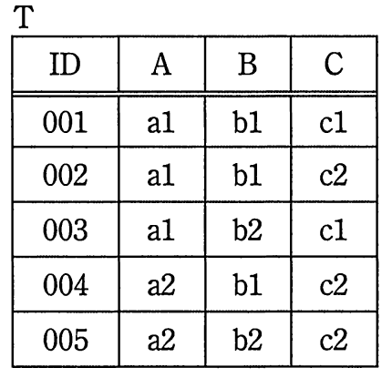

# 平成29年度秋期 問28（技術要素）

## 問題文

関係R（ID，A，B，C）のA，Cへの射影の結果とSQL文で求めた結果が同じになるように，aに入れるべき字句はどれか。ここで，関係Rを表Tで実現し，表Tに各行を格納したものを次に示す。

〔SQL文〕

　SELECT     a     A, C FROM T

ア　ALL

イ　DISTINCT

ウ　ORDER BY

エ　REFERENCES

## 使用画像

