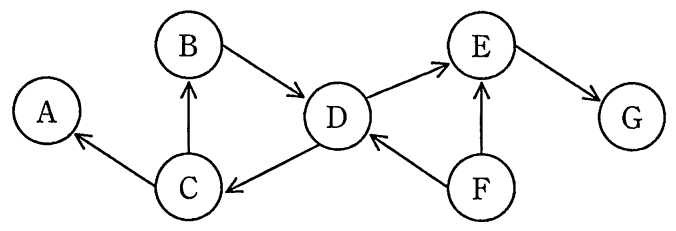

# 平成29年度秋期 問29（コンピュータシステム）

## 問題文

トランザクションA〜Gの待ちグラフにおいて，永久待ちの状態になっているトランザクション全てを列挙したものはどれか。ここで，待ちグラフのX→Yは，トランザクションXはトランザクションYがロックしている資源のアンロックを待っていることを表す。

〔トランザクションA〜Gの待ちグラフ〕

ア　A，B，C，D

イ　B，C，D

ウ　B，C，D，F

エ　C，D，E，F，G

## 使用画像

