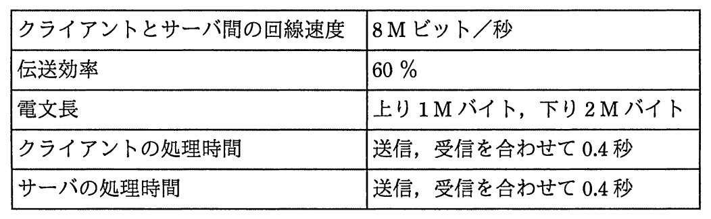

# 平成29年度秋期 問32（技術要素）

## 問題文

設置場所が異なるクライアントとサーバ間で，次の条件で通信を行う場合の応答時間は何秒か。ここで，クライアントの送信処理の始まりから受信処理の終了までを応答時間とし，距離による遅延は考慮しないものとする。

〔条件〕

ア　1.4

イ　3.8

ウ　5.0

エ　5.8

## 使用画像

## 解答と解説

**正解：エ**

条件は以下のとおり。

- 回線速度：8Mビット/秒
- 伝送効率：60％
- 電文長：上り1Mバイト（=8Mビット）、下り2Mバイト（=16Mビット）
- クライアントの処理時間：0.4秒
- サーバの処理時間：0.4秒

実効伝送速度は 8M×0.6＝4.8Mビット/秒。上り・下りの合計データ量は 8＋16＝24Mビットなので、伝送にかかる時間は 24÷4.8＝5秒。

これにクライアントとサーバの処理時間（0.4＋0.4＝0.8秒）を加えると、応答時間は 5＋0.8＝5.8秒となる。

以上より、正解はエである。

**IPA公式：エ**
