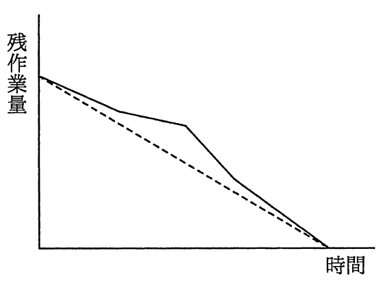
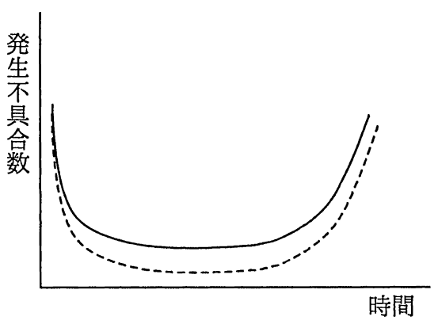
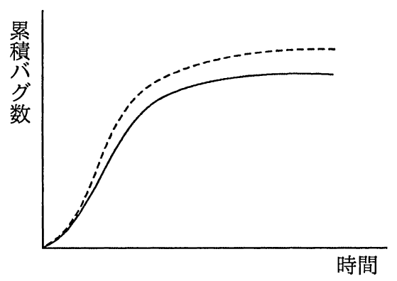
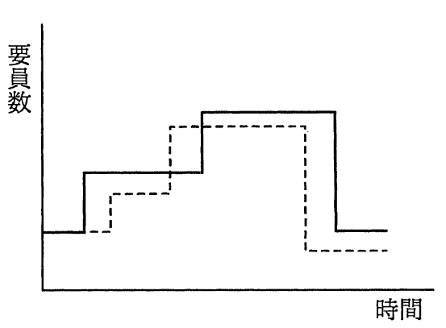

# 平成29年度秋期 問50（開発技術）

## 問題文

アジャイル開発におけるプラクティスの一つであるバーンダウンチャートはどれか。ここで，図中の破線は予定又は予想を，実線は実績を表す。

ア　

イ　

ウ　

エ

## 使用画像

## 解答と解説

**正解：ア**

バーンダウンチャートは、縦軸に「残作業量」、横軸に「時間（経過日数）」をとり、破線で予定の消化ペース、実線で実績の消化ペースを表すグラフである。イテレーションの進行に伴い残作業量が右下がりに減少していく様子を表す。画像01（AP2017AA050-01.gif）が縦軸「残作業量」で右下がりの折れ線グラフとなっており、この特徴に合致する。

- イ（画像02）：縦軸が「発生不具合数」でU字型のグラフであり、テスト工程での不具合発生の推移（バスタブ曲線に近い形）を表すもので、バーンダウンチャートではない。
- ウ（画像03）：縦軸が「累積バグ数」でS字型に収束していくグラフであり、信頼度成長曲線（ゴンペルツ曲線など）の説明である。
- エ（画像04）：縦軸が「要員数」で階段状に変化するグラフであり、要員計画（人員投入曲線）を表すもので、バーンダウンチャートではない。

**IPA公式：ア**

