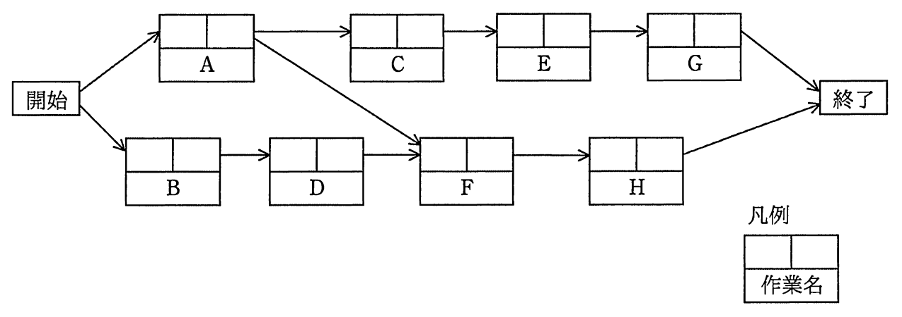
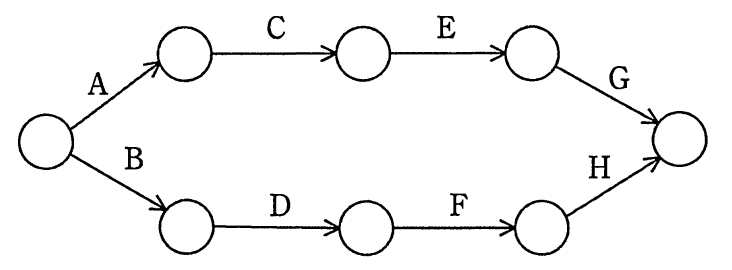
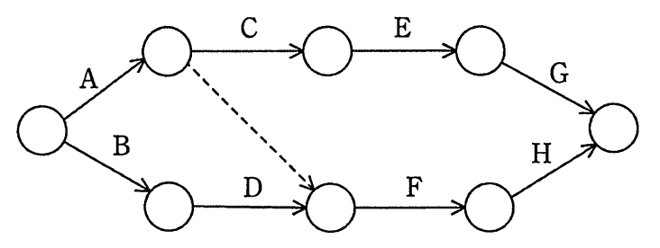
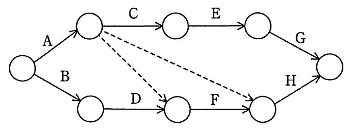
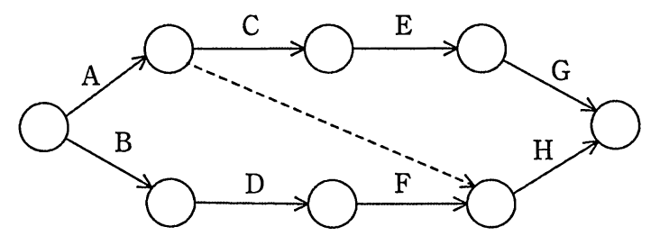
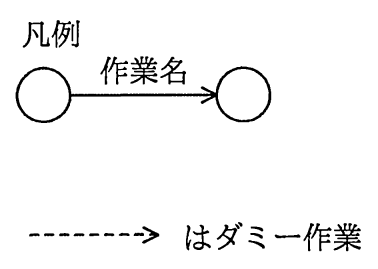

# 平成29年度秋期 問53（マネジメント）

## 問題文

次のプレシデンスダイアグラムで表現されたプロジェクトスケジュールネットワーク図を，アローダイアグラムに書き直したものはどれか。ここで，プレシデンスダイアグラムの依存関係は全てFS関係とする。

ア　

イ　

ウ　

エ

## 使用画像

## 解答と解説

**正解：イ**

画像01のプレシデンスダイアグラムでは、A→C→E→G の系列と B→D→F→H の系列が並行し、さらにAの終了後にFが開始できるという依存関係（Aの直後からF直前ノードへの依存）が存在する。すべての依存関係がFS（Finish-to-Start）関係であるため、アローダイアグラムに書き直す際、この「Aの終了後にFが開始できる」という制約を表現するには、A完了ノードからF開始ノードへ実際の作業を伴わない「ダミー作業（点線矢印）」を1本追加する必要がある。

画像03がこの条件を満たしており、Aの終了ノードからFの開始ノードへ1本のダミー作業（点線）が追加された図になっている。これにより、C・E・Gの系列とD・Fの系列の両方がAの完了に依存する関係を過不足なく表現できる。

- 画像02（選択肢アに相当）：ダミー作業が全く無く、AとFの依存関係が表現されていないため誤り。
- 画像04（選択肢ウに相当）：ダミー作業が2本あり、AからF・Hの両方に依存関係が追加されて余分な制約が生じているため誤り。
- 画像05（選択肢エに相当）：AからHへ直接ダミーが引かれており、Fを経由すべき依存関係が正しく表現されていないため誤り。

**IPA公式：イ**

