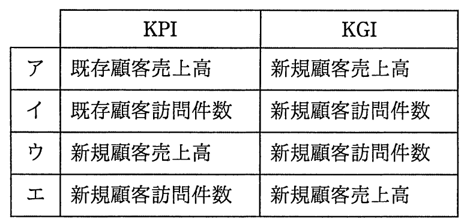

# 平成29年度秋期 問67（ストラテジ）

## 問題文

営業部門で設定するKPIとKGIの適切な組合せはどれか。

## 使用画像

## 解答と解説

**正解：エ**

KGI（Key Goal Indicator：重要目標達成指標）は最終的に達成すべき経営目標を表す指標であり、KPI（Key Performance Indicator：重要業績評価指標）はKGIの達成に向けたプロセスの実行状況を測る中間指標である。営業部門の最終目標（KGI）は「新規顧客売上高」のような成果指標であり、その達成に向けた活動量を測るKPIは「新規顧客訪問件数」のような行動プロセス指標が適している。

画像の選択肢のうち、エは「KPI：新規顧客訪問件数」「KGI：新規顧客売上高」という組合せであり、訪問件数（プロセス指標）を積み重ねた結果として売上高（成果指標）が達成されるという因果関係が成立しており、KPIとKGIの関係として適切である。

- ア：KPIが既存顧客売上高、KGIが新規顧客売上高であり、両者の対象顧客層が異なり因果関係が成立しない。
- イ：KPIが既存顧客訪問件数、KGIが新規顧客訪問件数であり、いずれも活動量（プロセス）指標であって、KGIとして最終成果を表していない。
- ウ：KPIが新規顧客売上高（成果指標）、KGIが新規顧客訪問件数（プロセス指標）であり、KPIとKGIの関係が逆転している。

したがって、正解はエである。

**IPA公式：エ**

