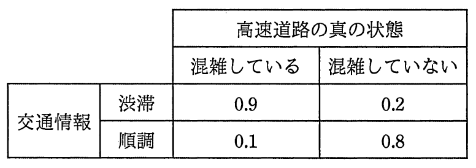

# 平成29年度秋期 問75（ストラテジ）

## 問題文

本社から工場まで車で行くのに，一般道路では80分掛かる。高速道路を利用すると，混雑していなければ50分，混雑していれば100分掛かる。高速道路の交通情報が“順調”ならば高速道路を利用し，“渋滞”ならば一般道路を利用するとき，期待できる平均所要時間は約何分か。ここで，高速道路の混雑具合の確率は，混雑している状態が0.4，混雑していない状態が0.6とし，高速道路の真の状態に対する交通情報の発表の確率は表のとおりとする。

ア　62

イ　66

ウ　68

エ　72

## 使用画像

## 解答と解説

**正解：イ**

条件付き確率（ベイズの定理）を使って、交通情報の発表内容ごとの実際の所要時間の期待値を求める。

高速道路の真の状態の事前確率は、混雑している：0.4、混雑していない：0.6。

交通情報が発表される確率を求める。
- 「渋滞」と発表される確率 ＝ 0.4×0.9（混雑時に渋滞と発表）＋0.6×0.2（非混雑時に渋滞と発表）＝0.36＋0.12＝0.48
- 「順調」と発表される確率 ＝ 0.4×0.1（混雑時に順調と発表）＋0.6×0.8（非混雑時に順調と発表）＝0.04＋0.48＝0.52

問題の条件では、交通情報が「渋滞」なら一般道路（80分固定）を利用し、「順調」なら高速道路を利用する。

「順調」発表時に高速道路を使った場合の所要時間の期待値を、ベイズの定理で事後確率を求めて計算する。
- 順調発表時に実際は混雑している事後確率＝0.04／0.52＝1/13
- 順調発表時に実際は混雑していない事後確率＝0.48／0.52＝12/13
- 期待所要時間＝100×(1/13)＋50×(12/13)＝(100＋600)/13＝700/13≒53.8分

全体の期待所要時間＝P(渋滞)×80＋P(順調)×53.8＝0.48×80＋0.52×53.8＝38.4＋27.98≒66.4分

小数第1位を四捨五入すると約66分となり、イが正解である。

**IPA公式：イ**

