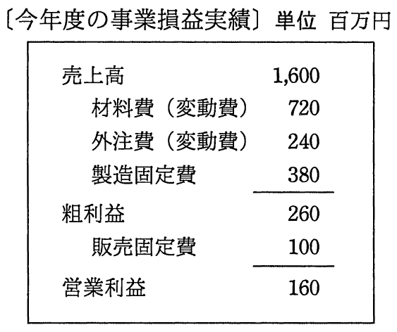

# 平成29年度秋期 問77（ストラテジ）

## 問題文

今年度の事業損益実績は表のとおりである。来年度の営業利益目標を240百万円としたとき，来年度の目標売上高は何百万円か。ここで，来年度の変動費率は今年度と同じであり，製造固定費と販売固定費は今年度に比べそれぞれ80百万円，20百万円の増加を見込む。

ア　1,750

イ　1,780

ウ　1,800

エ　2,050

## 使用画像

