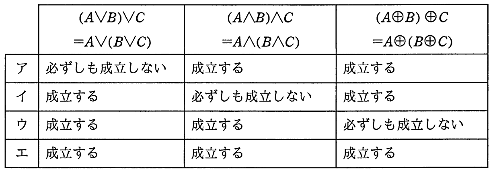

# 平成29年度春期 問1（基礎理論）

## 問題文

論理和（∨），論理積（∧），排他的論理和（⊕）の結合法則の成立に関する記述として，適切な組合せはどれか。

## 使用画像

## 解答と解説

**正解：エ**

結合法則とは，複数の演算を連続して行うとき，どこから先に計算しても結果が変わらない性質である。論理和∨，論理積∧，排他的論理和⊕はいずれも2項演算として結合法則を満たすことが知られている。

- 論理和：(A∨B)∨C＝A∨(B∨C) は真理値表で全パターンを確認しても常に成立する。∨はOR演算であり，どの順でORを取っても最終的に「いずれかが1なら1」という結果は変わらないため成立する。
- 論理積：(A∧B)∧C＝A∧(B∧C) も同様に，どの順でANDを取っても「すべてが1のときだけ1」という結果は変わらないため成立する。
- 排他的論理和：(A⊕B)⊕C＝A⊕(B⊕C) は，⊕が「1の個数の偶奇（パリティ）」を表す演算であるため，どの順で計算してもA，B，Cのうち1の個数が奇数かどうかという結果は変わらず，成立する。

以上より，論理和・論理積・排他的論理和のいずれについても結合法則は常に成立する。したがって，3つの演算すべてで「成立する」としている組合せが正しく，選択肢エが該当する。

**IPA公式：エ**
