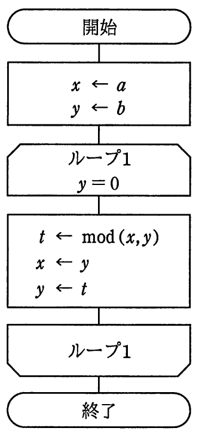

# 平成29年度春期 問6（基礎理論）

## 問題文

次の流れ図の処理で，終了時のxに格納されているものはどれか。ここで，与えられたa，bは正の整数であり，mod（x，y）はxをyで割った余りを返す。

ア　aとbの最小公倍数

イ　aとbの最大公約数

ウ　aとbの小さい方に最も近い素数

エ　aをbで割った商

## 使用画像

## 解答と解説

**正解：イ**

流れ図の処理内容は次のとおりである。

1. x←a，y←b で初期化する。
2. y＝0になるまで，次を繰り返す（ループ1）。
   - t←mod(x, y)
   - x←y
   - y←t
3. y＝0になったらループを抜けて終了し，このときのxの値が出力される。

これはユークリッドの互除法そのものである。互除法は，2つの正整数a，bについて「大きい方を小さい方で割った余りを求め，割る数と余りの組に置き換える」という操作を，余りが0になるまで繰り返すことで最大公約数を求めるアルゴリズムである。

具体例（a＝12，b＝8）で検算すると：
- 初期：x=12, y=8
- 1回目：t=mod(12,8)=4, x=8, y=4
- 2回目：t=mod(8,4)=0, x=4, y=0
- y=0なのでループ終了。x=4（12と8の最大公約数は4で一致）

したがって，終了時のxにはaとbの最大公約数が格納されており，イが正解である。最小公倍数（ア）や素数（ウ），単純な商（エ）を求める処理ではない。

**IPA公式：イ**
