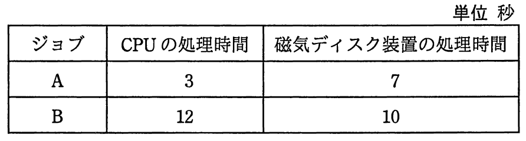
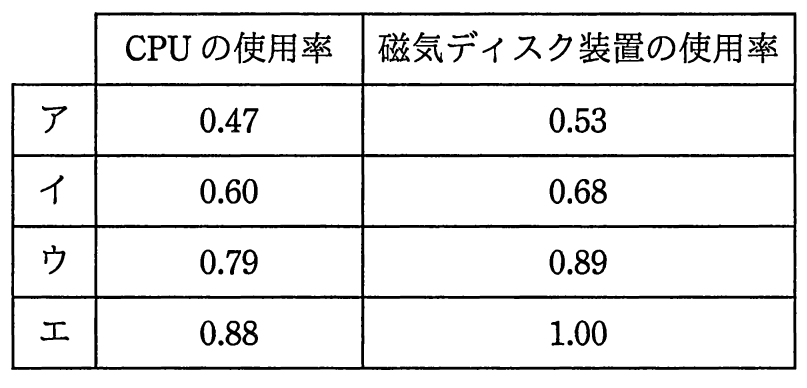

# 平成29年度春期 問13（コンピュータシステム）

## 問題文

CPUと磁気ディスク装置で構成されるシステムで，表に示すジョブA，Bを実行する。この二つのジョブが実行を終了するまでのCPUの使用率と磁気ディスク装置の使用率との組合せのうち，適切なものはどれか。ここで，ジョブA，Bはシステムの動作開始時点ではいずれも実行可能状態にあり，A，Bの順で実行される。CPU及び磁気ディスク装置は，ともに一つの要求だけを発生順に処理する。ジョブA，Bとも，CPUの処理を終了した後，磁気ディスク装置の処理を実行する。

## 使用画像

## 解答と解説

**正解：イ**

表より、ジョブAはCPU処理3秒、磁気ディスク処理7秒、ジョブBはCPU処理12秒、磁気ディスク処理10秒である。A、Bの順で実行され、CPUとディスクはそれぞれ一度に一つの要求しか処理できない。

タイムチャートを追うと次のようになる。

- ジョブA：CPU処理を0〜3秒で実行し、続けて磁気ディスク処理を3〜10秒で実行する。
- ジョブB：AのCPU処理が終わる3秒からCPU処理を開始し、3〜15秒（12秒間）実行する。
- ジョブBの磁気ディスク処理は、BのCPU処理終了（15秒）とAのディスク処理終了（10秒）のいずれか遅い方、すなわち15秒から開始し、15〜25秒（10秒間）実行する。

したがって、全体の処理が終了するのは25秒後である。

- CPU使用率：Aの3秒＋Bの12秒＝15秒 ÷ 25秒 ＝ 0.60
- 磁気ディスク使用率：Aの7秒＋Bの10秒＝17秒 ÷ 25秒 ＝ 0.68

この組合せに一致するのは イ（CPU使用率0.60、磁気ディスク装置使用率0.68）である。

**IPA公式：イ**
