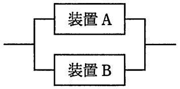

# 平成29年度春期 問15（コンピュータシステム）

## 問題文

図に示す二つの装置から構成される並列システムの稼働率は幾らか。ここで，どちらか一つの装置が稼働していればシステムとして稼働しているとみなし，装置A，Bとも，MTBFは450時間，MTTRは50時間とする。

ア　0.81

イ　0.90

ウ　0.96

エ　0.99

## 使用画像

## 解答と解説

**正解：エ**

装置A、装置Bは並列（どちらか一方が稼働していればシステム全体が稼働しているとみなす）に接続されている。

各装置単体の稼働率は、MTBF（平均故障間隔）とMTTR（平均修理時間）から次のように求める。

装置の稼働率 ＝ MTBF ÷（MTBF＋MTTR）＝ 450 ÷（450＋50）＝ 450 ÷ 500 ＝ 0.9

並列システムでは、両方の装置が同時に故障している場合にのみシステムが停止する。したがって、システムの稼働率は「両方とも故障している確率」を1から引くことで求められる。

各装置の非稼働率（故障している確率）は 1－0.9＝0.1 であるから、

システム稼働率 ＝ 1－（0.1×0.1）＝ 1－0.01 ＝ 0.99

以上より、この並列システムの稼働率は0.99であり、エ が正解である。

**IPA公式：エ**
