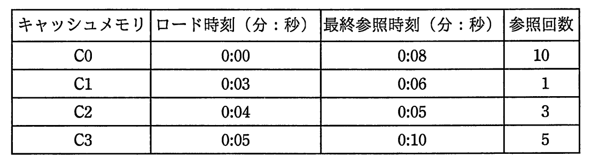

# 平成29年度春期 問16（コンピュータシステム）

## 問題文

4ブロックのキャッシュメモリC0〜C3が表に示す状態である。ここで，新たに別のブロックの内容をキャッシュメモリにロードする必要が生じたとき，C2のブロックを置換の対象とするアルゴリズムはどれか。

ア　FIFO

イ　LFU

ウ　LIFO

エ　LRU

## 使用画像

## 解答と解説

**正解：エ**

表に示された各ブロックの最終参照時刻は、C0が0:08、C1が0:06、C2が0:05、C3が0:10である。

各置換アルゴリズムの考え方は次のとおり。

- FIFO（First In First Out）：最も古くロードされたブロックを置換する。ロード時刻が最も古いのはC0（0:00）であり、C2は該当しない。
- LFU（Least Frequently Used）：参照回数が最も少ないブロックを置換する。参照回数が最も少ないのはC1（1回）であり、C2（3回）は該当しない。
- LIFO（Last In First Out）：最も新しくロードされたブロックを置換する。ロード時刻が最も新しいのはC3（0:05）であり、C2（ロード時刻0:04）は該当しない。
- LRU（Least Recently Used）：最終参照時刻が最も古い（最も長く参照されていない）ブロックを置換する。最終参照時刻が最も古いのはC2（0:05）であり、これはC2を置換対象とする条件に合致する。

以上より、C2が置換対象となるのはLRUアルゴリズムであり、エ が正解である。

**IPA公式：エ**
