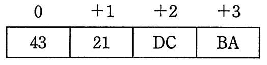
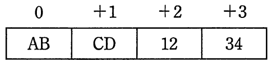

# 平成29年度春期 問21（コンピュータシステム）

## 問題文

16進数ABCD1234をリトルエンディアンで4バイトのメモリに配置したものはどれか。ここで，0〜＋3はバイトアドレスのオフセット値である。

ア　

イ　

ウ　

エ

## 使用画像

## 解答と解説

**正解：イ**

16進数ABCD1234を1バイトずつ区切ると、上位から順に「AB」「CD」「12」「34」の4バイトになる。リトルエンディアンは、数値の最下位バイトを最も低いアドレスに配置し、上位バイトほど高いアドレスに配置する方式である。

この数値の最下位バイト（最も右側、下位）は「34」であるため、これがアドレス0（オフセット0）に配置される。以下、アドレスの低い方から高い方へ向かって、

- アドレス0：34
- アドレス+1：12
- アドレス+2：CD
- アドレス+3：AB

の順に格納される。

これに合致するのは、0に34、+1に12、+2にCD、+3にABが並んでいる画像（AP2017SA021-02.gif）であり、選択肢イに対応する。

なお、ビッグエンディアンであれば最上位バイトから順にAB, CD, 12, 34と並ぶ（画像1に相当）が、本問はリトルエンディアンを問うているため該当しない。

**IPA公式：イ**

