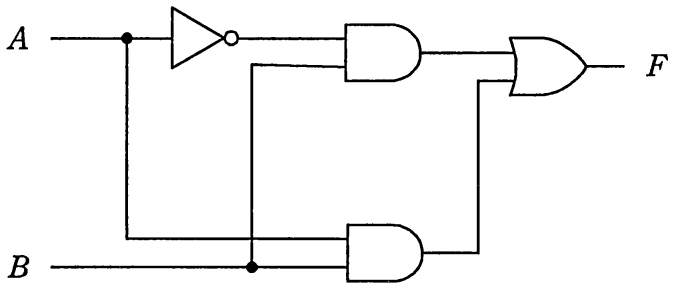

# 平成29年度春期 問23（コンピュータシステム）

## 問題文

図の回路が実現する論理式はどれか。ここで，論理式中の“・”は論理積，“＋”は論理和を表す。

ア　F＝A

イ　F＝B

ウ　F＝A・B

エ　F＝A＋B

## 使用画像

## 解答と解説

**正解：イ**

図の回路を上段と下段に分けて論理式を導く。

- 上段：Aがインバータ（NOT）を通った後、Bとの論理積（AND）をとる。したがって上段の出力は「NOT(A)・B」である。
- 下段：AとBがそのまま論理積（AND）をとられる。したがって下段の出力は「A・B」である。
- 最終段：上段と下段の出力を論理和（OR）でまとめる。

よって、
F = NOT(A)・B ＋ A・B

ここでBについて括り出すと、
F = B・(NOT(A) ＋ A)

NOT(A) ＋ A は常に真（1）であるブール代数の恒等式（排中律）なので、
F = B・1 = B

したがって、この回路が実現する論理式はF＝Bであり、選択肢イが正解となる。ア（F＝A）、ウ（F＝A・B）、エ（F＝A＋B）はいずれも回路の構造と一致しない。

**IPA公式：イ**

