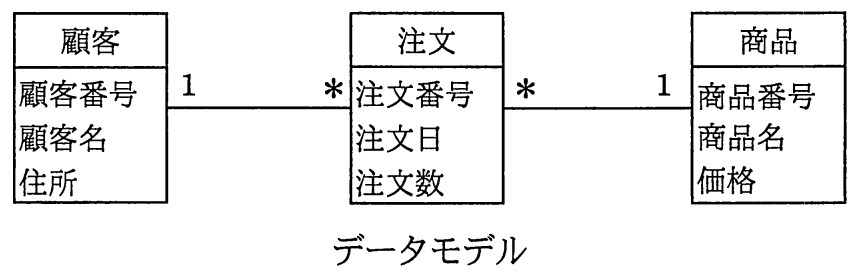
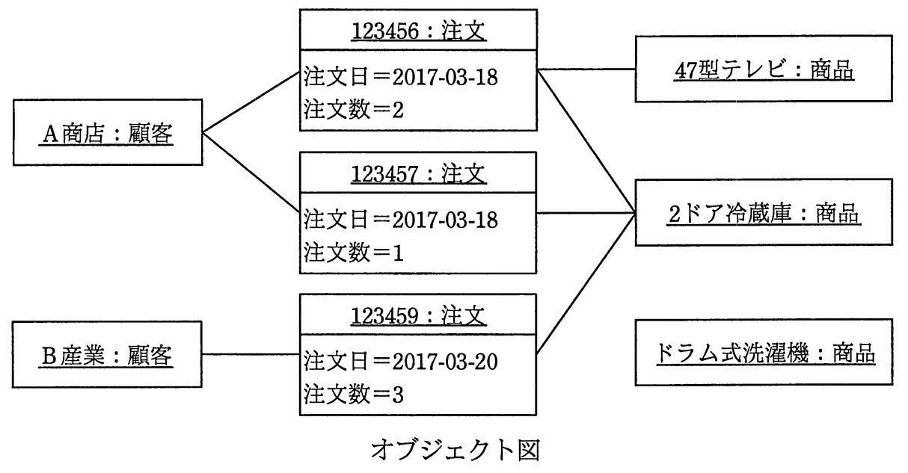

# 平成29年度春期 問26（技術要素）

## 問題文

データモデルを解釈してオブジェクト図を作成した。解釈の誤りを適切に指摘した記述はどれか。ここで，モデルの表記にはUMLを用い，オブジェクト図の一部の属性の表示は省略した。

ア　“123456：注文”が複数の商品にリンクしているのは，誤りである。

イ　“2ドア冷蔵庫：商品”が複数の注文にリンクしているのは，誤りである。

ウ　“A商店：顧客”が複数の注文にリンクしているのは，誤りである。

エ　“ドラム式洗濯機：商品”がどの注文にもリンクしていないのは，誤りである。

## 使用画像

## 解答と解説

**正解：ア**

データモデルでは、「顧客」と「注文」の間は多重度1対多（顧客1に対し注文*）、「注文」と「商品」の間は多重度多対1（注文*に対し商品1）と定義されている。つまり、1件の注文は必ず1つの商品にのみリンクするというルールである。

オブジェクト図を見ると、“123456：注文”というオブジェクトは、“47型テレビ：商品”と“2ドア冷蔵庫：商品”の両方にリンクしている。これは1件の注文が複数の商品にリンクしていることを意味し、データモデルが定めた「注文*→商品1」という多重度（1注文につき商品は1つ）に反する。したがって、この点はデータモデルの解釈誤りとして指摘すべき箇所であり、選択肢アが正しい。

他の選択肢を検証すると、いずれもデータモデルの制約に違反していない。

- イ　“2ドア冷蔵庫：商品”が複数の注文（123456，123457）にリンクしているのは、商品側の多重度が1（複数の注文から参照されうる）であるため問題ない。
- ウ　“A商店：顧客”が複数の注文（123456，123457）にリンクしているのは、顧客側の多重度が1対多であるため正しい。
- エ　“ドラム式洗濯機：商品”がどの注文にもリンクしていないのは、商品側の多重度に「0以上」を許容する制約が示されていないとしても、注文がまだない商品が存在すること自体は一般的な業務上あり得る状態であり、モデル上の誤りとして指摘する根拠にはならない。

以上より、解釈の誤りを適切に指摘しているのはアである。

**IPA公式：ア**

