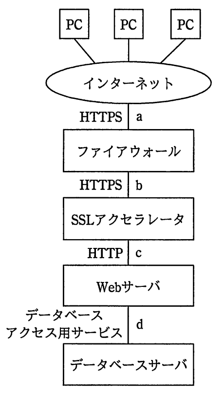

# 平成29年度春期 問43（技術要素）

## 問題文

図のような構成と通信サービスのシステムにおいて，Webアプリケーションの脆（ぜい）弱性対策のためのWAFの設置場所として，最も適切な箇所はどこか。ここで，WAFには通信を暗号化したり，復号したりする機能はないものとする。

ア　a

イ　b

ウ　c

エ　d

## 使用画像

## 解答と解説

**正解：ウ**

図の構成は、PC群からインターネット経由でHTTPSにより「a」の位置でファイアウォールへ到達し、ファイアウォールから「b」の位置でSSLアクセラレータへHTTPS通信、SSLアクセラレータで復号された後「c」の位置でHTTP（平文）としてWebサーバへ、その後「d」の位置でデータベースアクセス用サービスによりデータベースサーバへ、という流れになっている。

WAFはWebアプリケーションへのSQLインジェクションやクロスサイトスクリプティングなど、HTTPリクエストの中身を検査して防御する機器である。しかし、問題文の条件として「WAFには通信を暗号化・復号する機能はない」とされているため、通信内容が暗号化されたまま（HTTPS）の区間である a や b にWAFを置いても、リクエスト内容を検査できず機能しない。また d はデータベースアクセス用のプロトコルであり、HTTPリクエストを検査するWAFの対象ではない。

したがって、SSLアクセラレータで復号された後のHTTP平文区間である c にWAFを設置することで、Webアプリケーションへのリクエスト内容を検査でき、脆弱性対策として最も適切な設置場所となる。

以上より、正解はウである。

**IPA公式：ウ**
