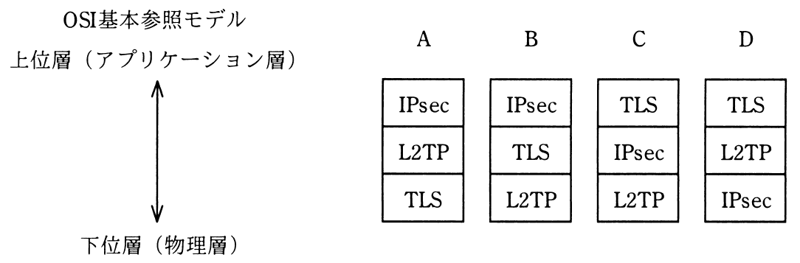

# 平成29年度春期 問45（技術要素）

## 問題文

VPNで使用されるセキュアなプロトコルであるIPsec，L2TP，TLSの，OSI基本参照モデルにおける相対的な位置関係はどれか。

ア　A

イ　B

ウ　C

エ　D

## 使用画像

## 解答と解説

**正解：ウ**

各プロトコルがOSI基本参照モデルのどの層に相当するかを整理すると次のとおりである。

- IPsec：ネットワーク層（IPパケットレベルでの暗号化・認証を行う）で動作し、比較的下位層に位置する。
- L2TP：データリンク層のフレームをトンネリングするプロトコルであり、IPsecより更に下位（物理層寄り）に位置づけられる。
- TLS：トランスポート層の上、アプリケーション層のすぐ下で動作し、3つの中では最も上位層に位置する。

したがって、上位層（アプリケーション層）に近い順に並べると「TLS→IPsec→L2TP」となる。図の選択肢のうち、上からTLS、IPsec、L2TPの順で並んでいるのはCであり、選択肢ではウが該当する。

ア（A）はIPsec、L2TP、TLSの順で上位層側にIPsecを置いており誤り。イ（B）はIPsec、TLS、L2TPの順で、IPsecが最も上位層側にあり誤り。エ（D）はTLS、L2TP、IPsecの順で、L2TPとIPsecの上下関係が逆になっており誤り。

以上より、正しい相対的な位置関係を示すのはウである。

**IPA公式：ウ**
