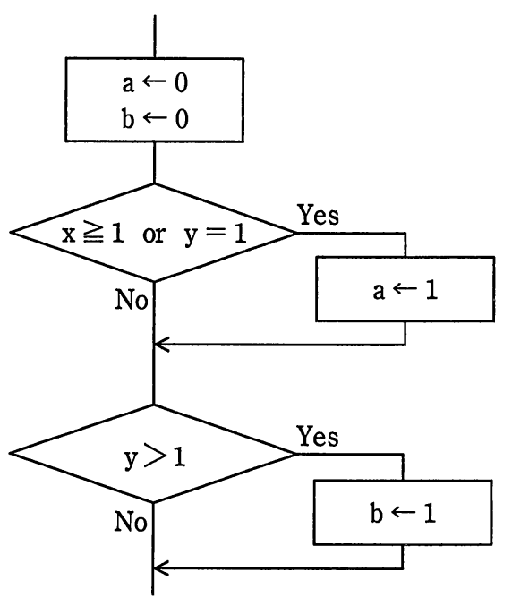
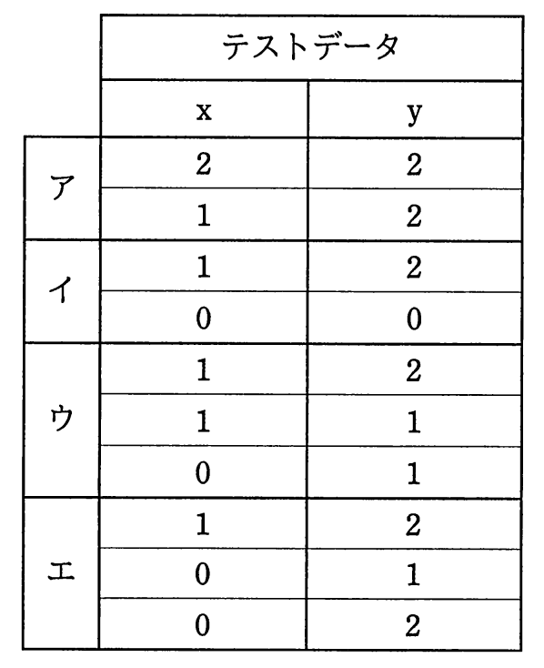

# 平成29年度春期 問48（開発技術）

## 問題文

流れ図において，分岐網羅を満たし，かつ，条件網羅を満たすテストデータの組みはどれか。

## 使用画像

## 解答と解説

**正解：エ**

流れ図には2つの判定がある。判定1は「x≧1 or y=1」、判定2は「y>1」である。

分岐網羅（判定条件網羅）は、各判定のYes分岐とNo分岐をそれぞれ少なくとも1回通ることを求める。条件網羅は、各判定を構成する個々の条件（x≧1の真偽、y=1の真偽、y>1の真偽）がそれぞれ少なくとも1回は真、1回は偽になることを求める、分岐網羅より厳しい基準である。

選択肢ウの3組（(x,y)=(1,2)、(1,1)、(0,1)）で検証する。
- (1,2)：x≧1は真なので判定1はYes、y>1は真なので判定2もYes。
- (1,1)：x≧1は真なので判定1はYes、y>1は偽（y=1）なので判定2はNo。
- (0,1)：x≧1は偽だがy=1が真なので判定1はYes、y>1は偽なので判定2はNo。

この3組では判定1が常にYesとなり、判定1のNo分岐が一度も通らないため分岐網羅を満たさない。

選択肢エの3組（(1,2)、(0,1)、(0,2)）を検証する。
- (1,2)：x≧1真→判定1Yes、y>1真→判定2Yes。
- (0,1)：x≧1偽・y=1真→判定1Yes、y>1偽→判定2No。
- (0,2)：x≧1偽・y=1偽→判定1No、y>1真→判定2Yes。

判定1はYes・No両方が現れ、判定2もYes・No両方が現れるため分岐網羅を満たす。条件についても、x≧1はT（1,2で）とF（0,1と0,2で）の両方、y=1はT（0,1）とF（1,2と0,2）の両方、y>1はT（1,2と0,2）とF（0,1）の両方が現れており、条件網羅も満たす。

なお選択肢アは判定1のNo分岐が現れず分岐網羅を満たさない。選択肢イは判定1・判定2ともYes/Noは現れるが、y=1がTになるケースがなく条件網羅を満たさない。

以上より、分岐網羅と条件網羅の両方を満たすのはエである。

**IPA公式：エ**
