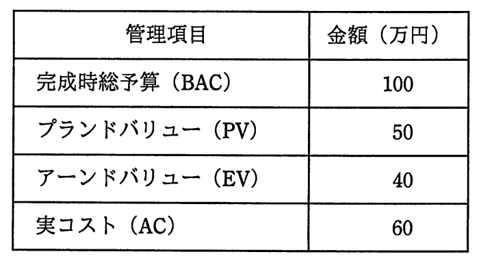

# 平成29年度春期 問51（マネジメント）

## 問題文

期間10日間のプロジェクトを，5日目の終了時にアーンドバリュー分析したところ，表のとおりであった。現在のコスト効率が今後も続く場合，完成時総コスト見積り（EAC）は何万円か。

ア　110

イ　120

ウ　135

エ　150

## 使用画像

## 解答と解説

**正解：エ**

アーンドバリュー分析（EVM）では、コスト効率指数CPI（Cost Performance Index）を用いて、現在のコスト効率が今後も続くと仮定した場合の完成時総コスト見積り（EAC: Estimate At Completion）を算出できる。

表の値は、完成時総予算（BAC）=100万円、プランドバリュー（PV）=50万円、アーンドバリュー（EV）=40万円、実コスト（AC）=60万円である。

CPI = EV ÷ AC = 40 ÷ 60 = 2/3

現在のコスト効率が今後も続くと仮定した場合のEACは、次の式で求める。

EAC = BAC ÷ CPI = 100 ÷ (2/3) = 150（万円）

したがって、完成時総コスト見積り（EAC）は150万円となり、正解はエである。

なお、PVは進捗計画上の予算消化額、EVは実際に完了した作業の予算換算額を表す指標であり、本問の答えの算出には直接使わない（CPIの算出にはEVとACのみを用いる）。

**IPA公式：エ**

