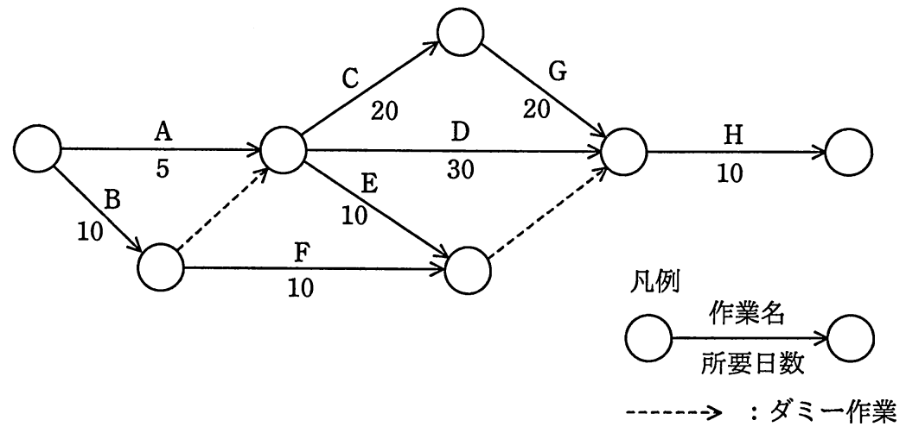

# 平成29年度春期 問52（マネジメント）

## 問題文

図のアローダイアグラムから読み取ったことのうち，適切なものはどれか。ここで，プロジェクトの開始日は0日目とする。

ア　作業Cを最も早く開始できるのは5日目である。

イ　作業Dはクリティカルパス上の作業である。

ウ　作業Eの余裕日数は30日である。

エ　作業Fを最も遅く開始できるのは10日目である。

## 使用画像

## 解答と解説

**正解：ウ**

アローダイアグラムの各作業について、最早開始時刻（ES）と最遅開始時刻（LS）を計算し、余裕日数（トータルフロート＝LS−ES）を求める。

ノード構成は、開始点から作業Aで中間ノードN1へ（5日）、作業Bで中間ノードN2へ（10日）、N2からN1へダミー作業、N1から作業Cでノードへ（20日）、N1から作業Dで合流点へ（30日）、N1から作業Eでノードへ（10日）、N2から作業Fで同ノードへ（10日）、そのノードからダミー作業で合流点へ、合流点で作業C側からGで合流（20日）、最後に作業Hで終了（10日）となっている。

最早開始時刻を前進計算すると、N1のES=10日（B10日＋ダミー0日がA5日より遅いため）、作業CのES=10日、作業DのES=10日、作業EのES=10日、E・F合流ノードのES=20日、G前ノードのES=30日、G・D・ダミー合流点のES=50日（Dの10+30=40、Gの10+20+20=50、E/F側の20+0=20のうち最大値）、終了点＝60日。

最遅開始時刻を後退計算すると、合流点のLS=50日、Gの前ノードのLS=30日、D作業のLS=20日、E・F合流ノードのLS=50日となる。

作業Eの余裕日数＝E・F合流ノードのLS（50）－作業EのES（10）－作業Eの所要日数を考慮した差分＝50－10－10＝30日となり、選択肢ウ「作業Eの余裕日数は30日である」は正しい。

他の選択肢は、作業Cの最早開始が10日目（アは誤り）、クリティカルパスはA→C→G→Hであり作業Dはクリティカルパス上にない（イは誤り）、作業Fの最遅開始は40日目である（エは誤り）ため、いずれも不適切である。

**IPA公式：ウ**

