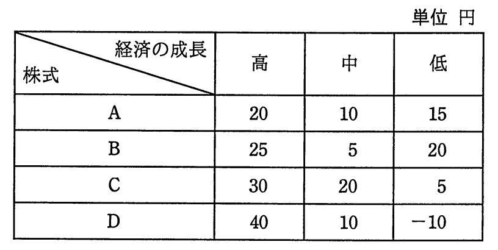

# 平成29年度春期 問76（ストラテジ）

## 問題文

いずれも時価100円の株式A〜Dのうち，一つの株式に投資したい。経済の成長を高，中，低の三つに区分したときのそれぞれの株式の予想値上がり幅は，表のとおりである。マクシミン原理に従うとき，どの株式に投資することになるか。

ア　A

イ　B

ウ　C

エ　D

## 使用画像

## 解答と解説

**正解：ア**

マクシミン原理（maximin：最悪の場合の利得を最大化する）は、各選択肢について起こりうる結果のうち最悪（最小）の値を求め、その最悪値が最も大きい選択肢を選ぶという悲観的な意思決定基準である。

表の各株式について、経済成長「高・中・低」のうち最小の値（最悪の値）を求める。

- 株式A：min(20, 10, 15) = 10
- 株式B：min(25, 5, 20) = 5
- 株式C：min(30, 20, 5) = 5
- 株式D：min(40, 10, −10) = −10

各株式の最悪値を比較すると、A(10) > B(5) = C(5) > D(−10) となり、最悪値が最大となるのは株式Aの10円である。マクシミン原理はリスクを避け、最悪の事態でも最も損失が少ない（利得が大きい）選択肢を選ぶ考え方なので、株式Aに投資することになる。

したがって正解はアである。

**IPA公式：ア**

