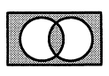
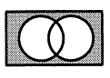
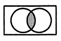
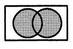

# 平成30年度秋期 問1（基礎理論）

## 問題文

任意のオペランドに対するブール演算Aの結果とブール演算Bの結果が互いに否定の関係にあるとき，AはBの（又は，BはAの）相補演算であるという。排他的論理和の相補演算はどれか。

ア　等価演算　（）

イ　否定論理和（）

ウ　論理積　　（）

エ　論理和　　（）

## 使用画像

## 解答と解説

**正解：ア**

排他的論理和（XOR）は、2つの入力が異なるとき1、等しいとき0となる演算である。相補演算とは、任意の入力に対して結果が常に逆（否定）になる演算のことなので、XORの相補演算はXORの結果を反転させた演算、すなわち等価演算（XNOR、2つの入力が等しいとき1、異なるとき0）である。

各選択肢の意味は以下のとおり。

- ア　等価演算（XNOR）：入力が一致すれば1。XORの否定そのものであり、正解。
- イ　否定論理和（NOR）：論理和（OR）の否定であり、XORの否定ではない。
- ウ　論理積（AND）：両方1のときのみ1。XORとは別の演算で相補関係にない。
- エ　論理和（OR）：少なくとも一方が1なら1。これもXORの否定ではない。

ベン図で考えても、XORは「どちらか一方だけが真の領域」を表すのに対し、等価演算はその補集合（両方真の領域＋両方偽の領域）を表すため、両者は完全に相補の関係にある。

**IPA公式：ア**

