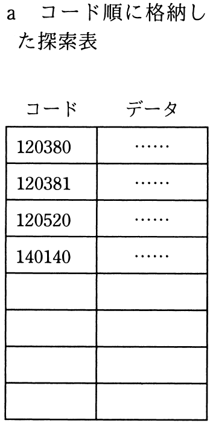
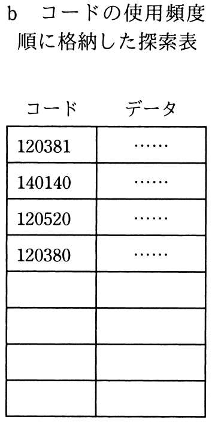
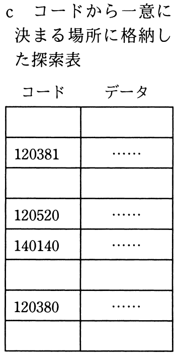
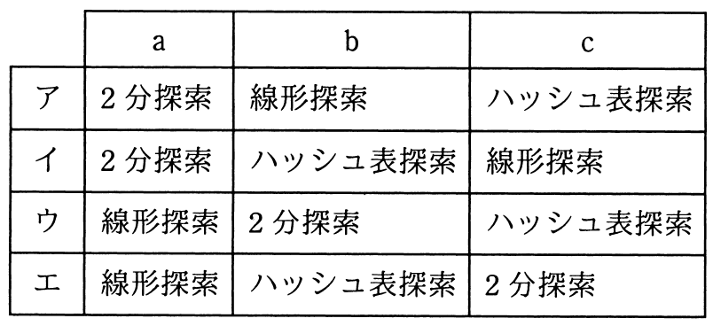

# 平成30年度秋期 問8（基礎理論）

## 問題文

探索表の構成法を例とともにa〜cに示す。最も適した探索手法の組合せはどれか。ここで，探索表のコードの空欄は表の空きを示す。

## 使用画像

## 解答と解説

**正解：ア**

画像の3つの探索表の構成は以下のとおり。

- a　コード（120380, 120381, 120520, 140140）が昇順に整列して格納されている。整列済みデータに対しては、中央の値と比較しながら探索範囲を半分に絞り込む**2分探索**が最も適している。
- b　コードの使用頻度順（120381, 140140, 120520, 120380）に格納されており、コードの値そのものでは整列されていない。整列されていないデータでは、先頭から順に1件ずつ比較する**線形探索**しか使えない。
- c　コードから計算した位置（ハッシュ値）に直接格納されている。この場合はコードからハッシュ関数で格納位置を直接算出してアクセスする**ハッシュ表探索**が適している。

したがって、a＝2分探索、b＝線形探索、c＝ハッシュ表探索の組合せとなる選択肢アが正解である。

**IPA公式：ア**

