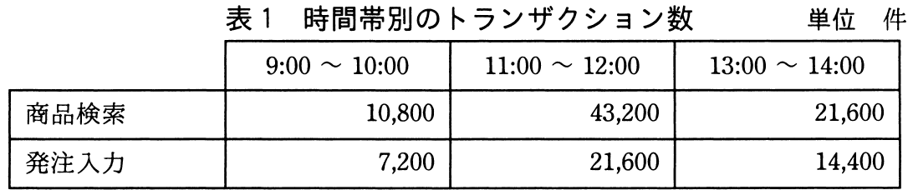
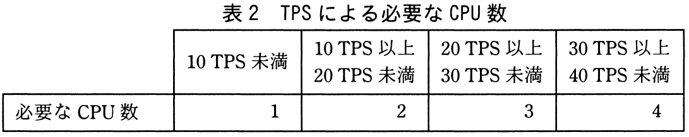

# 平成30年度秋期 問13（コンピュータシステム）

## 問題文

商品検索と発注入力が可能なWebシステムについて，時間帯別のトランザクション数を表1に，TPS（Transaction Per Second）による必要なCPU数を表2に示す。このWebシステムに必要かつ十分なCPU数は幾つか。ここで，OSのオーバヘッドなどの処理については無視でき，トランザクションはそれぞれの時間帯の中で均等に発生するものとする。

ア　1

イ　2

ウ　3

エ　4

## 使用画像

## 解答と解説

**正解：イ**

各時間帯（1時間＝3,600秒）ごとに、商品検索と発注入力の合計トランザクション数から必要TPSを求め、表2に照らして必要CPU数を求める。

- 9:00〜10:00：(10,800＋7,200)÷3,600＝5 TPS → 10TPS未満なのでCPU数1
- 11:00〜12:00：(43,200＋21,600)÷3,600＝18 TPS → 10以上20未満なのでCPU数2
- 13:00〜14:00：(21,600＋14,400)÷3,600＝10 TPS → 10以上20未満なのでCPU数2

いずれの時間帯でも不足なく処理できる必要十分なCPU数は、最大値である2となる。したがって答えはイ。

**IPA公式：イ**

