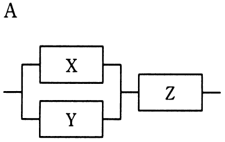
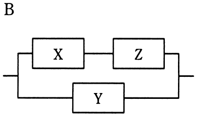

# 平成30年度秋期 問14（コンピュータシステム）

## 問題文

3台の装置X〜Zを接続したシステムA，Bの稼働率に関する記述のうち，適切なものはどれか。ここで，3台の装置の稼働率は，いずれも0より大きく1より小さいものとし，並列に接続されている部分は，どちらか一方が稼働していればよいものとする。

　

ア　各装置の稼働率の値によって，AとBの稼働率のどちらが高いかは変化する。

イ　常にAとBの稼働率は等しい。

ウ　常にAの稼働率が高い。

エ　常にBの稼働率が高い。

## 使用画像

## 解答と解説

**正解：エ**

システムAはX・Yの並列部分とZの直列構成、システムBは（X・Zの直列）とYの並列構成である。装置X,Y,Zの稼働率をいずれもrとして両者の稼働率を比較する。

- システムAの稼働率：{1－(1－r)²}×r
- システムBの稼働率：1－(1－r²)(1－r)

例えばr＝0.5のとき、A＝(1－0.25)×0.5＝0.375、B＝1－(0.75×0.5)＝0.625となりB＞A。r＝0.9のときもA＝0.891、B＝0.981となりB＞Aとなる。0＜r＜1の範囲で常にB＞Aが成り立つ（並列化されている装置の数が多いBの方が冗長性が高いため）。よって「常にBの稼働率が高い」というエが正しい。

**IPA公式：エ**

