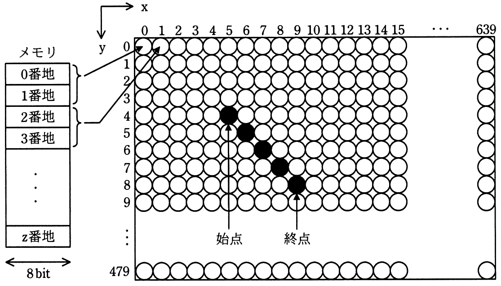

# 平成30年度秋期 問20（コンピュータシステム）

## 問題文

次の方式で画素にメモリを割り当てる640×480のグラフィックLCDモジュールがある。座標（x，y）で始点（5，4）から終点（9,8）まで直線を描画するとき，直線上のx＝7の画素に割り当てられたメモリのアドレスの先頭は何番地か。

〔方式〕

・メモリは0番地から昇順に使用する。

・1画素は16ビットとする。

・座標（0，0）から座標（639，479）まで連続して割り当てる。

・各画素は，x＝0からx軸の方向にメモリを割り当てていく。

・x＝639の次はx＝0とし，yを1増やす。

ア　3847番地

イ　7680番地

ウ　7694番地

エ　8978番地

## 使用画像

## 解答と解説

**正解：ウ**

始点(5,4)から終点(9,8)への直線は、dx＝9－5＝4、dy＝8－4＝4より傾き1の直線であり、y＝x－1と表せる。x＝7のとき、y＝7－1＝6となる。

画素は座標(0,0)からx軸方向に順に割り当てられ、y行ごとに640画素（x＝0〜639）を使用し、1画素＝16ビット＝2バイトである。よって座標(x, y)＝(7, 6)のアドレスの先頭は次のように求まる。

アドレス＝(y×640＋x)×2＝(6×640＋7)×2＝(3840＋7)×2＝3847×2＝7694番地

したがって答えはウ。

**IPA公式：ウ**

