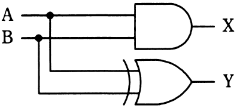
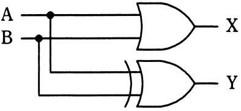
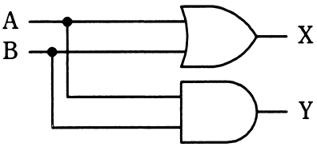
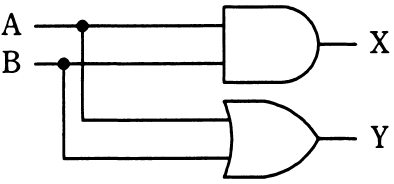

# 平成30年度秋期 問23（コンピュータシステム）

## 問題文

1桁の2進数A，Bを加算し，Xに桁上がり，Yに桁上げなしの和（和の1桁目）が得られる論理回路はどれか。

ア　

イ　

ウ　

エ

## 使用画像

## 解答と解説

**正解：ア**

半加算器（half adder）は、1桁の2進数A，Bを加算し、桁上がり（キャリー）Xと桁上げなしの和（サム）Yを得る回路である。真理値表を考えると、A=B=1のときのみX=1（桁上がりが発生）となるため、Xは論理積（AND）で表される。一方Yは、AとBが異なる値のときに1となるため、排他的論理和（XOR）で表される。

- X = A AND B（桁上がり）
- Y = A XOR B（和）

画像を確認すると、1枚目（AP2018AA023-01.gif）は、出力Xが論理積（AND、丸みのない平らな背面を持つゲート）、出力Yが排他的論理和（XOR、ゲート背面に二重の曲線が描かれているのが特徴）で構成されており、これが正しい半加算器の構成に一致する。

他の選択肢は、Xに論理和（OR）ゲートを用いていたり（2枚目・3枚目）、Yに論理積（AND）ゲートや通常の論理和（OR、二重線のないもの）を用いていたり（3枚目・4枚目）するなど、桁上がり・和の真理値表と一致しないため誤り。

**IPA公式：ア**
