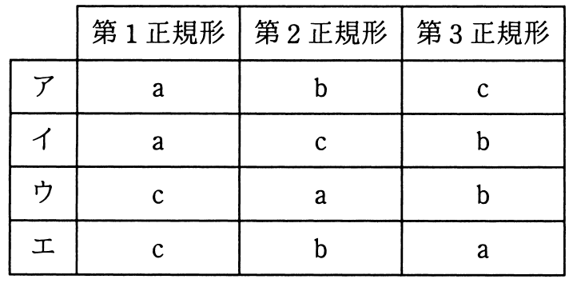

# 平成30年度秋期 問28（技術要素）

## 問題文

第1，第2，第3正規形とそれらの特徴a〜cの組合せのうち，適切なものはどれか。

a：どの非キー属性も，主キーの真部分集合に対して関数従属しない。

b：どの非キー属性も，主キーに推移的に関数従属しない。

c：繰返し属性が存在しない。

## 使用画像

## 解答と解説

**正解：ウ**

正規化の各段階の特徴は次のとおりである。

- 第1正規形：繰返し項目（繰返し属性）を排除し、全ての属性を単一の値にする → 特徴c
- 第2正規形：第1正規形の条件を満たした上で、非キー属性が主キーの真部分集合に対して部分関数従属しない（＝主キー全体に完全関数従属する） → 特徴a
- 第3正規形：第2正規形の条件を満たした上で、非キー属性が主キーに推移的に関数従属しない → 特徴b

したがって、第1正規形＝c、第2正規形＝a、第3正規形＝bという組合せが正しく、これは選択肢ウ（第1正規形：c、第2正規形：a、第3正規形：b）に一致する。

**IPA公式：ウ**
