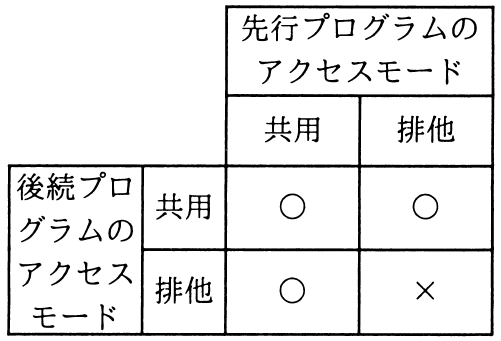
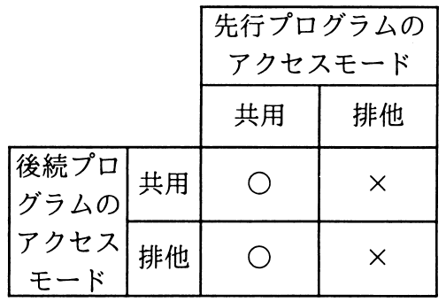
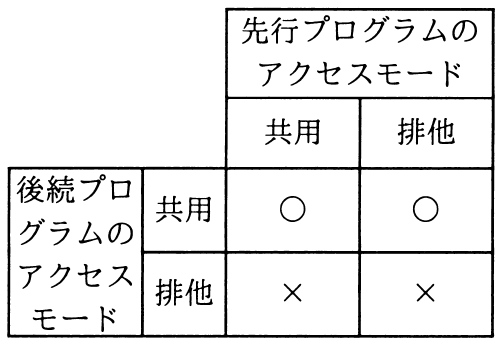
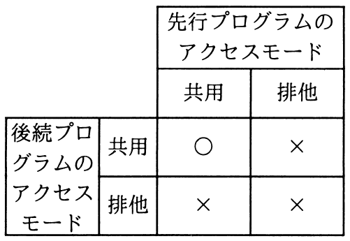

# 平成30年度秋期 問30（基礎理論）

## 問題文

データベースシステムにおいて，二つのプログラムが同一データへのアクセス要求を行うとき，後続プログラムのアクセス要求に対する並行実行の可否の組合せのうち，適切なものはどれか。ここで，表中の〇は二つのプログラムが並行して実行されることを表し，×は先行プログラムの実行終了まで後続プログラムは待たされることを表す。

ア　

イ　

ウ　

エ

## 使用画像

