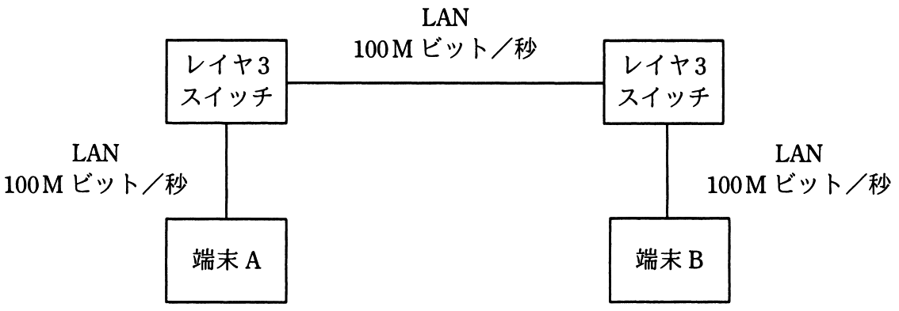

# 平成30年度秋期 問31（技術要素）

## 問題文

2台の端末と2台のレイヤ3スイッチが図のようにLANで接続されているとき，端末Aがフレームを送信し始めてから，端末Bがそのフレームを受信し終わるまでの時間は，およそ何ミリ秒か。

〔条件〕

フレーム長：1,000バイト

LANの伝送速度：100Mビット／秒

レイヤ3スイッチにおける1フレームの処理時間：0.2ミリ秒

レイヤ3スイッチは，1フレームの受信を完了してから送信を開始する。

ア　0.24

イ　0.43

ウ　0.48

エ　0.64

## 使用画像

## 解答と解説

**正解：エ**

端末A→レイヤ3スイッチ1→レイヤ3スイッチ2→端末Bという経路で、LAN区間が3つ（端末A-SW1間、SW1-SW2間、SW2-端末B間）、レイヤ3スイッチでの処理が2回ある。

フレーム長1,000バイト＝8,000ビットを、伝送速度100Mビット／秒の回線で送信するのにかかる時間（伝送遅延）は、
8,000 ÷ 100,000,000 = 0.00008秒 = 0.08ミリ秒

各区間で同様に0.08ミリ秒かかるので、3区間分の伝送時間は 0.08 × 3 = 0.24ミリ秒。

さらに、レイヤ3スイッチは「1フレームの受信を完了してから送信を開始する」（ストアアンドフォワード方式）ため、各スイッチでの処理時間0.2ミリ秒が加わる。スイッチは2台あるので、処理時間の合計は 0.2 × 2 = 0.4ミリ秒。

合計時間 = 0.24（伝送時間） + 0.4（処理時間） = 0.64ミリ秒

これが端末Aの送信開始から端末Bの受信完了までの時間となる。

**IPA公式：エ**
