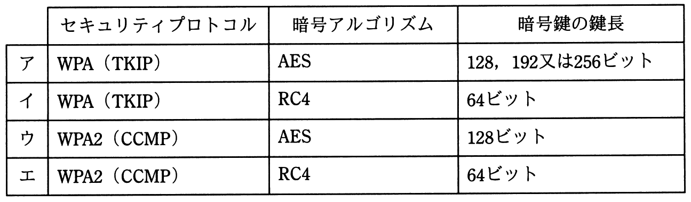

# 平成30年度秋期 問45（技術要素）

## 問題文

無線LANのセキュリティプロトコル，暗号アルゴリズム，暗号鍵の鍵長の組合せのうち，適切なものはどれか。

## 使用画像

## 解答と解説

**正解：ウ**

画像の表は選択肢ごとにセキュリティプロトコル・暗号アルゴリズム・鍵長の組合せを示している。無線LANのセキュリティプロトコルとしては、WEPの脆弱性を受けて策定されたWPAがRC4（TKIP）を採用し、その後継のWPA2ではCCMP（AESベースの暗号化モード）が採用されている。WPA2（CCMP）はAESを暗号アルゴリズムとして用い、鍵長は128ビットである。表のウの行「WPA2（CCMP）、AES、128ビット」がこの組合せと一致するため、ウが正解。

アはWPA2（CCMP）とAESの組合せは正しいが鍵長の記述が本来のWPA2規格（128ビット）と異なる範囲を含み不適切、イはWPA（TKIP）にRC4という組合せ自体は妥当だが鍵長が64ビットは誤り（TKIPの実効鍵長は128ビット相当）、エはWPA2（CCMP）にRC4という組合せが誤り（CCMPはAESベースでRC4は用いない）である。

**IPA公式：ウ**

