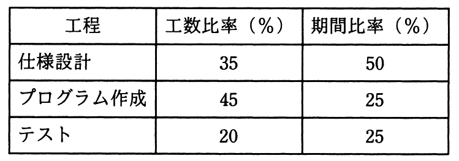

# 平成30年度秋期 問53（マネジメント）

## 問題文

あるシステムの開発工数を見積もると120人月であった。このシステムの開発を12か月で終えるように表に示す計画を立てる。プログラム作成工程には，何名の要員を確保しておく必要があるか。ここで，工程内での要員の増減はないものとする。

ア　7

イ　8

ウ　10

エ　18

## 使用画像

## 解答と解説

**正解：エ**

画像の表より、プログラム作成工程の工数比率は45%、期間比率は25%である。全体の開発工数は120人月、開発期間は12か月なので、プログラム作成工程の工数と期間はそれぞれ次のように計算できる。

- プログラム作成工程の工数 ＝ 120人月 × 45% ＝ 54人月
- プログラム作成工程の期間 ＝ 12か月 × 25% ＝ 3か月

必要な要員数は、工程の工数を期間で割って求める。

- 要員数 ＝ 54人月 ÷ 3か月 ＝ 18名

したがって、プログラム作成工程には18名の要員を確保する必要があり、エが正解となる。ア・イ・ウはこの計算過程のいずれかの数値を誤って使った場合に生じ得る値である。

**IPA公式：エ**

