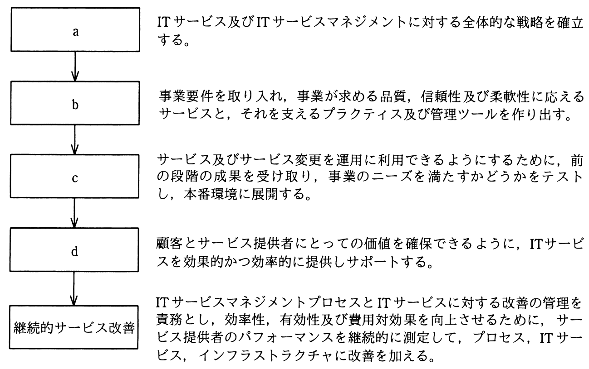
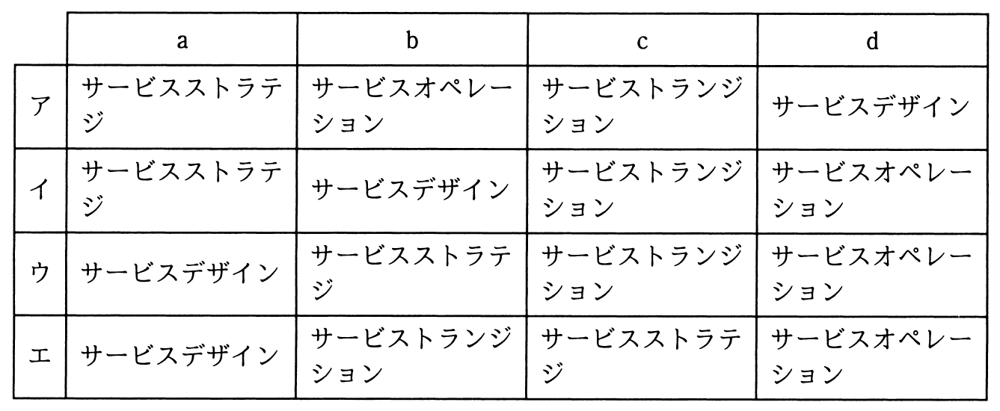

# 平成30年度秋期 問55（マネジメント）

## 問題文

図は，ITIL 2011 editionのサービスライフサイクルの各段階の説明と流れである。a〜dの段階名の適切な組合せはどれか。

## 使用画像

## 解答と解説

**正解：イ**

1枚目の画像はITIL 2011 editionのサービスライフサイクルの流れを示しており、a→b→c→dの順に「全体的な戦略を確立する」「事業要件を取り入れサービスと管理ツールを作り出す」「テストして本番環境に展開する」「サービスを効果的・効率的に提供しサポートする」という説明が続き、最後に「継続的サービス改善」につながる構成になっている。

これをITILの5つのコアプロセスに対応させると、aは全体戦略を確立する「サービスストラテジ」、bはサービスとそれを支えるプラクティス・ツールを設計する「サービスデザイン」、cはテストし本番環境へ展開する「サービストランジション」、dは日々のサービス提供・サポートを行う「サービスオペレーション」に該当する。

2枚目の画像（選択肢表）でこの組合せ「a：サービスストラテジ、b：サービスデザイン、c：サービストランジション、d：サービスオペレーション」に一致するのはイの行である。したがってイが正解。

**IPA公式：イ**

