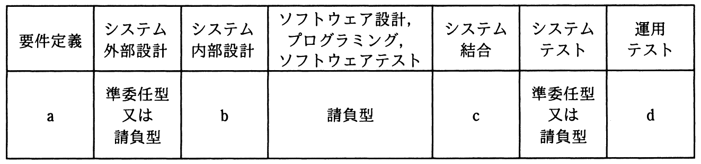

# 平成30年度秋期 問66（ストラテジ）

## 問題文

ベンダX社に対して，表に示すように要件定義フェーズから運用テストフェーズまでを委託したい。X社との契約に当たって，“情報システム・モデル取引・契約書＜第一版＞”に照らし，各フェーズの契約形態を整理した。a〜dの契約形態のうち，準委任型が適切であるとされるものはどれか。

ア　a，b

イ　a，d

ウ　b，c

エ　b，d

## 使用画像

