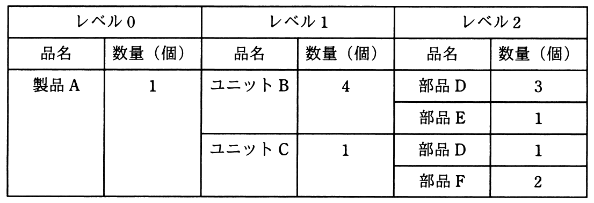

# 平成30年度秋期 問73（ストラテジ）

## 問題文

ある期間の生産計画において，表の部品表で表される製品Aの需要量が10個であるとき，部品Dの正味所要量は何個か。ここで，ユニットBの在庫残が5個，部品Dの在庫残が25個あり，他の在庫残，仕掛残，注文残，引当残などはないものとする。

ア　80

イ　90

ウ　95

エ　105

## 使用画像

## 解答と解説

**正解：イ**

部品表（画像参照）の構成は次のとおり。

- 製品A（1）→ ユニットB（4）、ユニットC（1）
- ユニットB（1）→ 部品D（3）、部品E（1）
- ユニットC（1）→ 部品D（1）、部品F（2）

製品Aの需要量は10個。

**ユニットBの総所要量**：10個 × 4 ＝ 40個。ユニットBの在庫残は5個なので、正味所要量＝40－5＝35個。

**ユニットCの総所要量**：10個 × 1 ＝ 10個。ユニットCには在庫残がないため、正味所要量＝10個。

**部品Dの総所要量**：
- ユニットB経由：35個 × 3 ＝ 105個（正味所要量ベースで下位品目の総所要量を計算する）
- ユニットC経由：10個 × 1 ＝ 10個
- 合計：105 ＋ 10 ＝ 115個

部品Dの在庫残は25個あるため、正味所要量＝115－25＝90個。

以上より、部品Dの正味所要量は90個となり、イが正解。

**IPA公式：イ**
