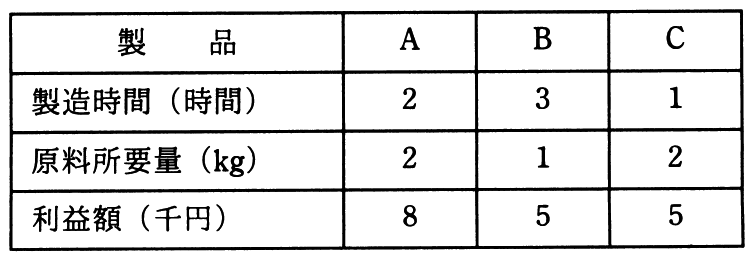

# 平成30年度秋期 問76（ストラテジ）

## 問題文

工場で，ある原料から生産している3種類の製品A，B及びCの単位量当たりの製造時間，原料所要量及び利益額を表に示す。この工場の月間合計製造時間は最大240時間であり，投入可能な原料は月間150kgである。

　このとき，各製品をそれぞれどれだけ作ると最も高い利益が得られるかを求めるのに用いられる手法はどれか。

ア　移動平均法

イ　最小二乗法

ウ　線形計画法

エ　定量発注法

## 使用画像

