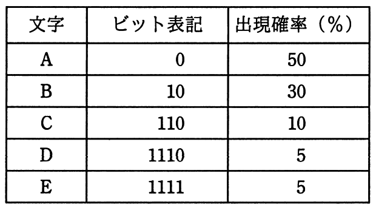

# 平成30年度春期 問2（基礎理論）

## 問題文

表は，文字A〜Eを符号化したときのビット表記と，それぞれの文字の出現確率を表したものである。1文字当たりの平均ビット数は幾らか。

ア　1.6

イ　1.8

ウ　2.5

エ　2.8

## 使用画像

## 解答と解説

**正解：イ**

1文字当たりの平均ビット数は、各文字の符号長（ビット表記の桁数）にその出現確率を掛けた値の総和（期待値）で求められる。画像の表から各文字の符号長と出現確率は次のとおりである。

- A：符号長1ビット、出現確率50%（0.5）
- B：符号長2ビット、出現確率30%（0.3）
- C：符号長3ビット、出現確率10%（0.1）
- D：符号長4ビット、出現確率5%（0.05）
- E：符号長4ビット、出現確率5%（0.05）

これらを用いて平均ビット数を計算すると、

　1×0.5 ＋ 2×0.3 ＋ 3×0.1 ＋ 4×0.05 ＋ 4×0.05
　＝ 0.5 ＋ 0.6 ＋ 0.3 ＋ 0.2 ＋ 0.2
　＝ 1.8

となる。したがって、1文字当たりの平均ビット数は1.8であり、選択肢イが正解となる。この符号化方式は、出現確率の高い文字ほど短いビット列を割り当てるハフマン符号の考え方に基づいた可変長符号化の例である。

**IPA公式：イ**

