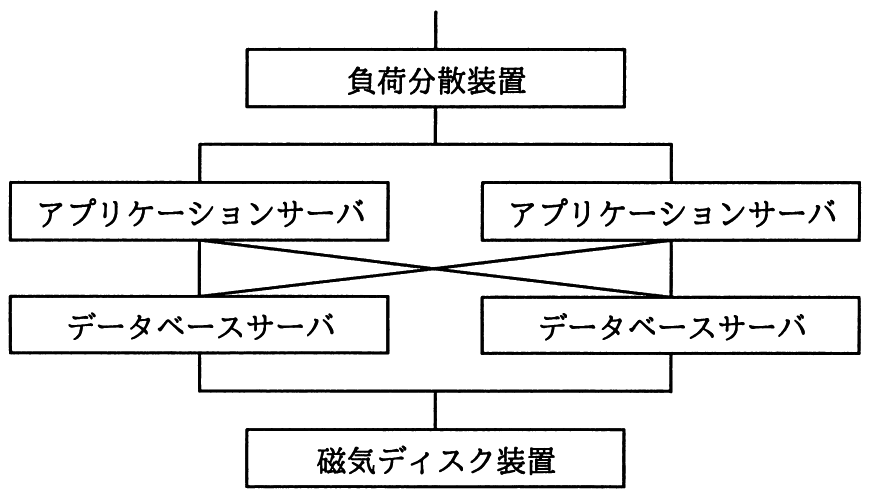

# 平成30年度春期 問16（コンピュータシステム）

## 問題文

4種類の装置で構成される次のシステムの稼働率は，およそ幾らか。ここで，アプリケーションサーバとデータベースサーバの稼働率は0.8であり，それぞれのサーバのどちらかが稼働していればシステムとして稼働する。また，負荷分散装置と磁気ディスク装置は，故障しないものとする。

ア　0.64

イ　0.77

ウ　0.92

エ　0.96

## 使用画像

