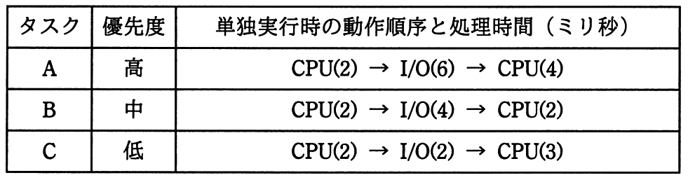

# 平成30年度春期 問17（コンピュータシステム）

## 問題文

三つのタスクA〜Cの優先度と各タスクを単独で実行した場合のCPUと入出力（I/O）装置の動作順序と処理時間は，表のとおりである。優先順位方式のタスクスケジューリングを行うOSの下で，三つのタスクが同時に実行可能状態になってから，タスクCが終了するまでに，タスクCが実行可能状態にある時間は延べ何ミリ秒か。ここで，I/Oは競合せず，OSのオーバヘッドは考慮しないものとする。また，表中の（）内の数字は処理時間を示すものとする。

ア　6

イ　8

ウ　10

エ　12

## 使用画像

