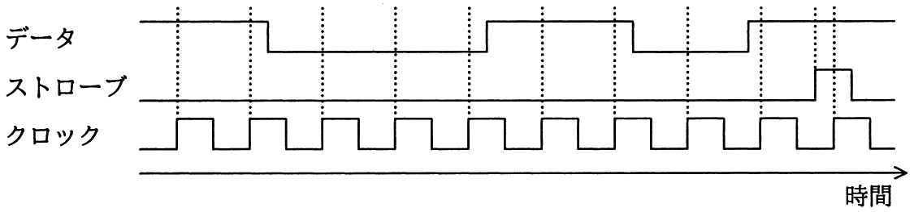

# 平成30年度春期 問22（コンピュータシステム）

## 問題文

クロックの立上りエッジで，データを入力の最下位ビットに取り込んで上位方向へシフトし，ストローブの立上りエッジで値を確定する8ビットのシリアル入力パラレル出力シフトレジスタがある。各信号の波形を観測した結果が図のとおりであるとき，確定後のシフトレジスタの値はどれか。ここで，数値は16進数で表記している。

ア　63

イ　8D

ウ　B1

エ　C6

## 使用画像

