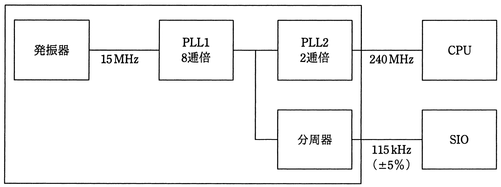

# 平成30年度春期 問23（コンピュータシステム）

## 問題文

ワンチップマイコンにおける内部クロック発生器のブロック図を示す。15MHzの発振器と，内部のPLL1，PLL2及び分周器の組合せでCPUに240MHz，シリアル通信（SIO）に115kHzのクロック信号を供給する場合の分周器の値は幾らか。ここで，シリアル通信のクロック精度は±5％以内に収まればよいものとする。

ア　1／24

イ　1／26

ウ　1／28

エ　1／210

## 使用画像

## 解答と解説

**正解：エ**

ブロック図より、15MHzの発振器出力はPLL1（8逓倍）を経て120MHz（=15MHz×8）となる。この120MHzの信号が分岐し、一方はPLL2（2逓倍）を経てCPUへ240MHz（=120MHz×2）として供給され、もう一方は分周器を経てSIOへ115kHz（±5%許容）として供給される。

分周器への入力は120MHzであり、分周比1／2ⁿのとき出力周波数は120MHz×(1／2ⁿ)となる。各選択肢について計算すると次のとおり。

- ア　1／2⁴：120MHz÷16 = 7.5MHz
- イ　1／2⁶：120MHz÷64 = 1.875MHz
- ウ　1／2⁸：120MHz÷256 ≒ 468.75kHz
- エ　1／2¹⁰：120MHz÷1024 ≒ 117.19kHz

目標値115kHzに対する許容範囲は±5%、すなわち109.25kHz〜120.75kHzである。この範囲に収まるのはエの117.19kHzのみであり、他の選択肢は目標値から大きく外れる。

したがって、分周器の値として適切なのはエの1／2¹⁰である。

**IPA公式：エ**

