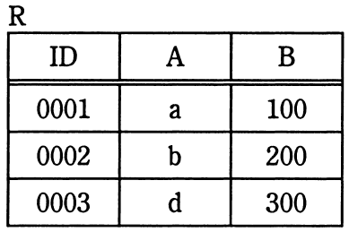
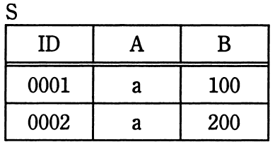
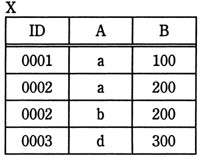

# 平成30年度春期 問27（技術要素）

## 問題文

関係Rと関係Sに対して，関係Xを求める関係演算はどれか。

　　

ア　IDで結合

イ　差

ウ　直積

エ　和

## 使用画像

## 解答と解説

**正解：エ**

関係R、S、Xの内容は次のとおりである。

- R = {(0001,a,100), (0002,b,200), (0003,d,300)}
- S = {(0001,a,100), (0002,a,200)}
- X = {(0001,a,100), (0002,a,200), (0002,b,200), (0003,d,300)}

Xの4行は、Rの3行（(0001,a,100)、(0002,b,200)、(0003,d,300)）とSの2行（(0001,a,100)、(0002,a,200)）を合わせて重複行((0001,a,100)が両方に存在)を1つにまとめたものと一致する。これはまさに和（UNION）演算の定義そのものであり、X = R ∪ S となる。

他の選択肢が誤りである理由は次のとおりである。

- ア「IDで結合」：結合（JOIN）はIDが一致する行同士を横に連結して列数が増える演算であり、Xの列構成（ID, A, B）と件数（4件）には合わない
- イ「差」：R－SやS－Rでは(0001,a,100)のような両方に共通する行は結果に含まれないはずだが、Xにはこの行が含まれているため差ではない
- ウ「直積」：直積はR（3行）×S（2行）＝6行になるはずだが、Xは4行しかないため直積ではない

**IPA公式：エ**

