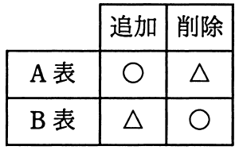
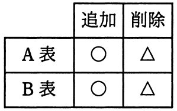
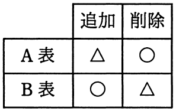
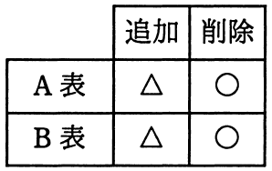

# 平成30年度春期 問28（技術要素）

## 問題文

SQLにおいて，A表の主キーがB表の外部キーによって参照されている場合，各表の行を追加・削除する操作の参照制約に関する制限について，正しく整理した図はどれか。ここで，△印は操作が拒否される場合があることを表し，○印は制限なしに操作ができることを表す。

ア　

イ　

ウ　

エ

## 使用画像

## 解答と解説

**正解：ア**

A表の主キーをB表が外部キーとして参照している（B表がA表を参照する子表）という前提で、参照制約に基づく追加・削除操作の可否を整理する。

- A表（親：参照される側）への行の**追加**：新しい主キー値を追加するだけであり、B表の既存の外部キー値との整合性を壊すことはないため、常に制限なく実行できる（○）
- A表（親）の行の**削除**：削除しようとする主キー値をB表がまだ参照している場合、参照整合性が崩れるため削除が拒否されることがある（△）
- B表（子：参照する側）への行の**追加**：追加する外部キー値がA表に存在しない場合は参照整合性違反となり拒否されることがある（△）
- B表（子）の行の**削除**：B表の行を削除してもA表の参照整合性には影響しないため、常に制限なく実行できる（○）

これを表にまとめると「A表：追加○・削除△」「B表：追加△・削除○」となり、選択肢アの図と一致する。

他の選択肢は、A表・B表双方が同じ制限パターンになっている（イ・エ）、またはA表とB表の○△が入れ替わっている（ウ）など、親子関係による非対称性を正しく表していないため誤りである。

**IPA公式：ア**

