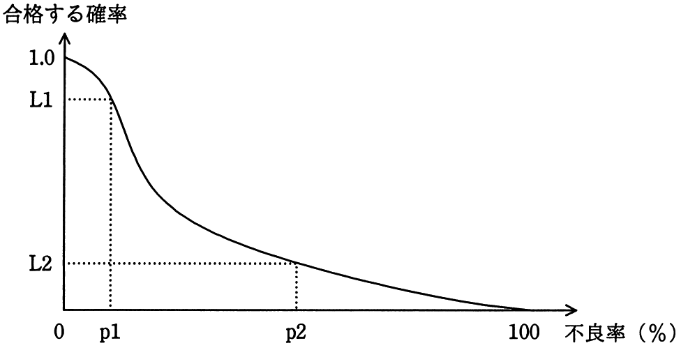

# 平成30年度春期 問74（ストラテジ）

## 問題文

図は，ある製品ロットの抜取り検査の結果を表すOC曲線（検査特性曲線）である。この図に関する記述のうち，適切なものはどれか。

ア　p1％よりも大きい不良率のロットが合格する確率は，L1よりも大きい。

イ　p1％よりも小さい不良率のロットが不合格となる確率は，（1.0−L1）よりも大きい。

ウ　p2％よりも大きい不良率のロットが合格する確率は，L2よりも小さい。

エ　p2％よりも小さい不良率のロットが不合格となる確率は，L2よりも小さい。

## 使用画像

