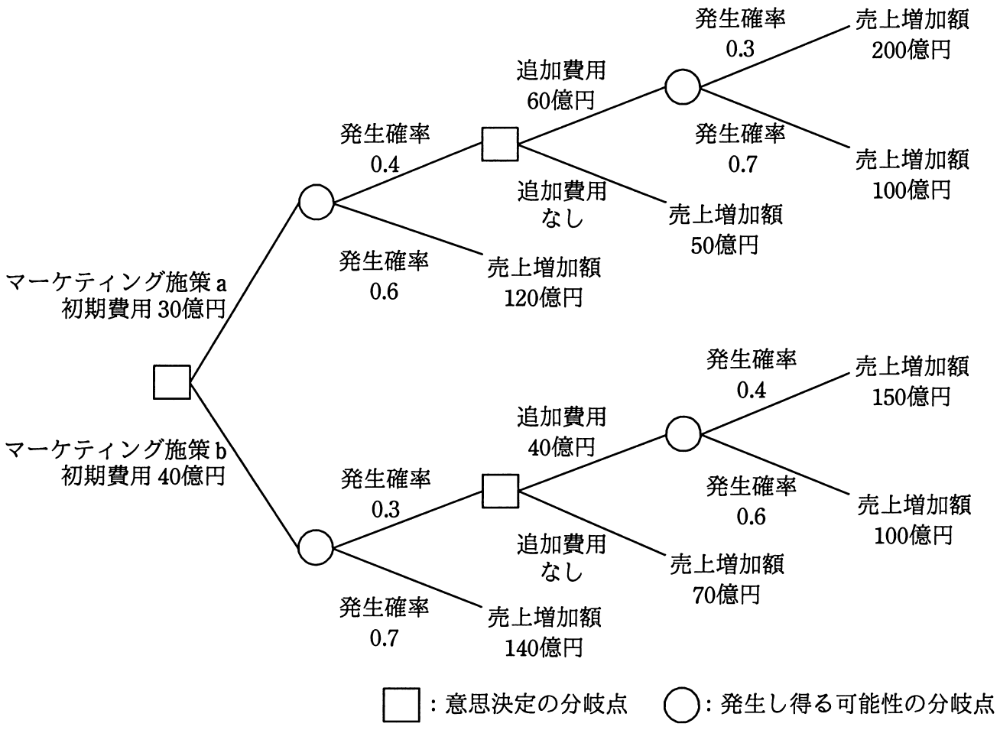

# 平成30年度春期 問75（ストラテジ）

## 問題文

ビッグデータ分析の手法の一つであるデシジョンツリーを活用してマーケティング施策の判断に必要な事象を整理し，発生確率の精度を向上させた上で二つのマーケティング施策a，bの選択を行う。マーケティング施策を実行した場合の利益増加額（売上増加額−費用）の期待値が最大となる施策と，そのときの利益増加額の期待値の組合せはどれか。

## 使用画像

