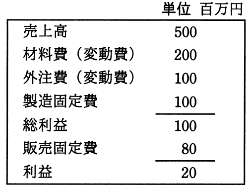

# 平成30年度春期 問77（ストラテジ）

## 問題文

損益計算資料から求められる損益分岐点売上高は，何百万円か。

ア　225

イ　300

ウ　450

エ　480

## 使用画像

## 解答と解説

**正解：ウ**

損益計算資料（単位：百万円）は、売上高500、材料費（変動費）200、外注費（変動費）100、製造固定費100、総利益100、販売固定費80、利益20である。

損益分岐点売上高を求めるには、まず変動費率と固定費の合計を算出する。
- 変動費合計 = 材料費200 + 外注費100 = 300百万円
- 変動費率 = 変動費合計 ÷ 売上高 = 300 ÷ 500 = 0.6
- 限界利益率 = 1 − 変動費率 = 0.4
- 固定費合計 = 製造固定費100 + 販売固定費80 = 180百万円

損益分岐点売上高 = 固定費合計 ÷ 限界利益率 = 180 ÷ 0.4 = 450百万円

したがって正解はウの450（百万円）である。検算として、売上高450のとき変動費は450×0.6＝270、利益＝450−270−180＝0となり、確かに損益分岐点であることが確認できる。

**IPA公式：ウ**
