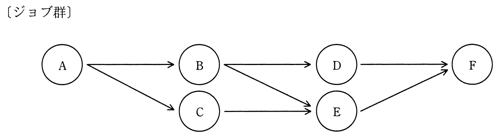
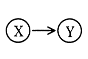
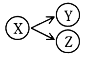
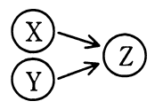

# 秋期 問17（コンピュータシステム）

## 問題文

ジョブ群と実行の条件が次のとおりであるとき，一時ファイルを作成する磁気ディスクに必要な容量は最低何Mバイトか。

〔実行の条件〕

（1）ジョブの実行多重度を2とする。

（2）各ジョブの処理時間は同一であり，他のジョブの影響は受けない。

（3）各ジョブは開始時に50Mバイトの一時ファイルを新たに作成する。

（4）の関係があれば，ジョブXの開始時に作成した一時ファイルは，直後のジョブYで参照し，ジョブYの終了時にその一時ファイルを削除する。直後のジョブが複数個ある場合には，最初に生起されるジョブだけが先行ジョブの一時ファイルを参照する。

（5）はジョブXの終了時に，ジョブY，ZのようにジョブXと矢印で結ばれる全てのジョブが，上から記述された順に優先して生起されることを示す。

（6）は先行するジョブX，Y両方が終了したときにジョブZが生起されることを示す。

（7）ジョブの生起とは実行待ち行列への追加を意味し，各ジョブは待ち行列の順に実行される。

（8）OSのオーバヘッドは考慮しない。

ア　100

イ　150

ウ　200

エ　250

## 使用画像

## 解答と解説

**正解：ウ**

ジョブ群の依存関係は、A→B・A→C、B→D・B→E、C→E、D→F・E→Fである。Dの先行はBのみ、Eの先行はB・C両方（合流）、Fの先行はD・E両方（合流）。実行多重度2、各ジョブの処理時間は同一として、時刻ごとに実行状況とディスク上の一時ファイル量を追跡する。

- **t0〜t1（A実行）**：Aのみ実行可能。A開始時に50Mバイトの一時ファイルを作成。ファイル量＝50M。
- **t1（A終了）**：Aの後続はB，Cの2つ。ルール(5)よりB，Cの順で待ち行列に追加され、直後ジョブが複数のため最初に生起するB「だけ」がAのファイルを参照し、B終了時に削除する。多重度2なのでB，Cが同時に開始。B，Cもそれぞれ50Mの一時ファイルを新規作成。この時点でのファイル量＝A(50)+B(50)+C(50)＝150M。
- **t2（B，C終了）**：Bの終了によりD，Eの生起条件（Dは先行Bのみ）が一部満たされ、Cの終了によりE（先行B，C両方）の生起条件も満たされる。よってB，C終了と同時にD，Eが生起し、多重度2なので両方開始。
  - B終了時：Aのファイルを削除（Bが最初の参照者だったため）。Bのファイルは後続がD，Eの2つあるため、最初に生起するD「だけ」が参照し、D終了時に削除される。
  - C終了時：Cのファイルは後続がEのみ（単独）のため、E終了時に削除される。
  - D，Eはそれぞれ開始時に新たに50Mの一時ファイルを作成する。
  - この瞬間のファイル量＝B(50，Dが参照中)+C(50，Eが参照中)+D(50，新規)+E(50，新規)＝**200M**。これが一連の処理の中でのピークとなる。
- **t3（D，E終了）**：D終了時にBのファイルを削除、E終了時にCのファイルを削除。D，Eの後続はF（両方の先行が必要な合流点）で、Fが生起し開始。D，Eそれぞれのファイルは後続がFのみのためF終了時に削除される。この時点のファイル量＝D(50)+E(50)+F(50)＝150M。
- **t4（F終了）**：F終了時にD，Eのファイルを削除。Fのファイルも後続がないため以後不要（削除）。

以上より、必要な最大容量はB，C，D，Eの一時ファイルが同時に存在するt2の時点で発生する200Mバイトであり、ウが正解となる。イ（150）はA，B，Cが同時に存在する時点、あるいはD，E，Fが同時に存在する時点の容量であり、ピークである200Mを見落とした場合に選びやすい誤答である。

**IPA公式：ウ**
