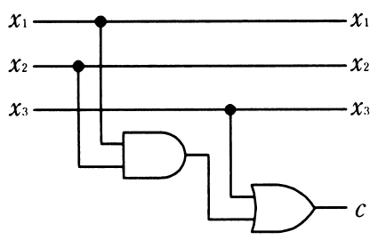
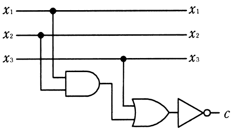
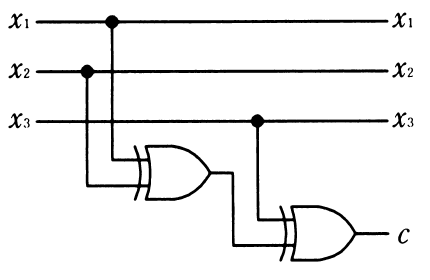
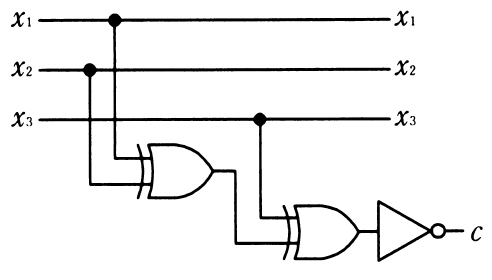

# 秋期 問23（コンピュータシステム）

## 問題文

3ビットのデータ$x_{1}$，$x_{2}$，$x_{3}$に偶数パリティビット$c$を付加する回路はどれか。

## 使用画像

## 解答と解説

**正解：ウ**

偶数パリティビットcは、x1・x2・x3のうち1の個数（＝XORの累積）が偶数になるように付加するビットであり、c = x1 XOR x2 XOR x3 で求められる。したがって回路はXOR（排他的論理和）ゲートを2段組み合わせて構成する必要がある。画像ウの回路は、x1とx2を1段目のXORゲートに入力し、その出力とx3を2段目のXORゲートに入力してcを得る構成になっており、これは c = x1 XOR x2 XOR x3 を正しく実現している。

- ア：1段目がAND、2段目がORのゲートで構成されており、これは偶数パリティではなく別の論理式（多数決に近い論理）になる。
- イ：アと同じAND-OR構成の出力をさらにNOT（否定）したものであり、これも偶数パリティの論理と一致しない。
- エ：1段目がXOR、2段目がXNOR（NOT付きXOR）になっており、これは奇数パリティビットの生成回路に相当する。

以上より、AND/ORではなくXORのみを2段使う構成が偶数パリティの正しい回路であり、正解はウである。

**IPA公式：ウ**
