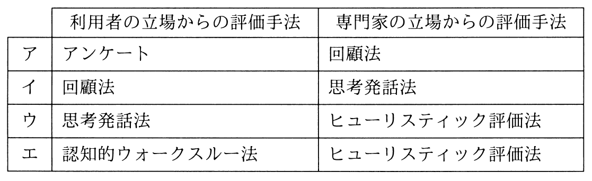

# 秋期 問24（技術要素）

## 問題文

ユーザインタフェースのユーザビリティを評価するときの，利用者の立場からの評価手法と専門家の立場からの評価手法の適切な組みはどれか。

## 使用画像

## 解答と解説

**正解：ウ**

ユーザビリティ評価手法は、実際の利用者が評価者となる「利用者立場の手法」と、専門家が知識・経験に基づいて評価する「専門家立場の手法」に大別される。画像の表のウでは、利用者の立場からの評価手法として「思考発話法」（利用者に操作しながら考えていることを声に出してもらい、思考過程を観察する手法）、専門家の立場からの評価手法として「ヒューリスティック評価法」（専門家が経験則・原則に照らして画面や操作を評価する手法）が組み合わされており、これは両者の対応関係として適切である。

- ア：回顧法（操作後に振り返って回答してもらう手法）は利用者側の手法であり、専門家側に置くのは誤り。
- イ：思考発話法は利用者側の手法であるべきだが、専門家側に置かれており対応が逆。
- エ：認知的ウォークスルー法は専門家が画面遷移を想定的に検証する専門家側の手法であり、利用者側に置くのは誤り。

以上より、利用者側＝思考発話法、専門家側＝ヒューリスティック評価法の組合せであるウが正解である。

**IPA公式：ウ**
